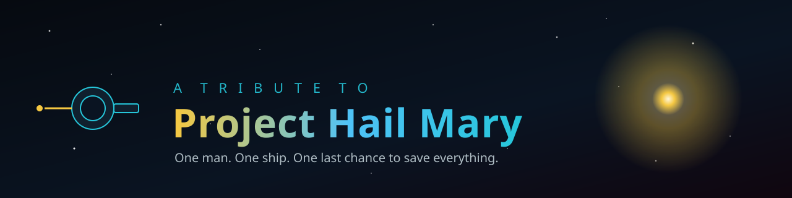

<div align="center">



# Project Hail Mary — A Tribute

*A single-page fan tribute to Andy Weir's bestselling novel and the upcoming Amazon MGM film.*

[](https://github.com/HighviewOne/ProjectHailMary/actions/workflows/deploy.yml)
[](https://highviewone.github.io/ProjectHailMary/)
[](#tech-stack)
[](#tech-stack)
[](LICENSE)

[**View the live site →**](https://highviewone.github.io/ProjectHailMary/)

</div>

---

## About

A self-contained, single-page tribute site celebrating *Project Hail Mary* — the novel and its forthcoming film adaptation. It walks visitors through the book, its (spoiler-light) premise, characters like the unforgettable Rocky, memorable quotes, the upcoming movie, and the real science woven through the story.

Everything ships in a single `index.html`: hand-written CSS, an animated star field, a hand-drawn SVG illustration of Rocky, and Rocky's synthesized tonal "voice" rendered live in the browser via the Web Audio API. No frameworks, no build step, no dependencies.

> *This is an unofficial, non-commercial fan project. Project Hail Mary is © Andy Weir. The film is a production of Amazon MGM Studios. All rights belong to their respective owners.*

## Features

- 🌌 **Animated star field** — a canvas backdrop of drifting stars
- 👽 **Hand-drawn Rocky** — an original inline-SVG illustration of the Eridian
- 🔊 **Rocky's voice** — synthesized tonal chords via the Web Audio API
- 📖 **Story sections** — the novel, premise, characters, quotes, film, and science
- 🎬 **Film details** — cast and crew of the Amazon MGM adaptation
- 📱 **Responsive & smooth** — mobile-friendly layout with scroll-reveal animations
- ⭐ **Custom SVG favicon** — a gold star inside a teal ring

## Tech Stack

| Layer | Choice |
|-------|--------|
| Markup | Hand-written HTML5 |
| Styling | Vanilla CSS (custom properties, no preprocessor) |
| Graphics | Inline SVG + HTML canvas star field |
| Audio | Web Audio API |
| Hosting | GitHub Pages |
| CI/CD | GitHub Actions |

**Zero runtime dependencies.** The entire site is static.

## Quick Start

No build step is required — it's plain static files.

```bash
git clone https://github.com/HighviewOne/ProjectHailMary.git
cd ProjectHailMary

# Open directly...
open index.html

# ...or serve locally (recommended, so the Web Audio API behaves)
python3 -m http.server 8000
# then visit http://localhost:8000
```

## Deployment

Every push to `main` is automatically published to GitHub Pages via
[`.github/workflows/deploy.yml`](.github/workflows/deploy.yml). The site is served from the
repository root, so editing `index.html` and pushing is all it takes to ship.

## Project Structure

```
ProjectHailMary/
├── index.html              # The entire site (markup, styles, scripts)
├── favicon.svg             # Gold-star-and-teal-ring favicon
├── .github/
│   ├── banner.svg          # README banner
│   └── workflows/
│       └── deploy.yml       # GitHub Pages deployment
└── README.md
```

## Contributing

Contributions and corrections are welcome — see [issue and PR templates](.github/) when opening one.
Since the whole site lives in `index.html`, keep changes focused and preview them locally before submitting.

## License

Released under the [MIT License](LICENSE) for the **code**. *Project Hail Mary*, its characters, and
related artwork remain the intellectual property of Andy Weir and Amazon MGM Studios; this project
claims no ownership over them.
